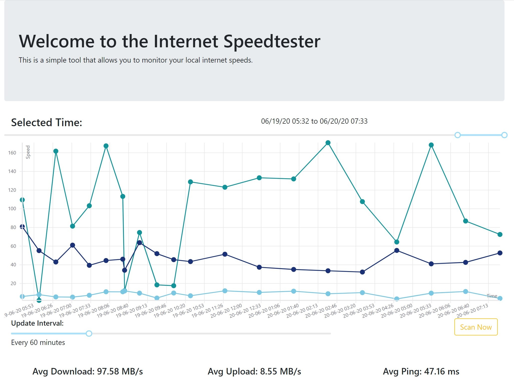

# docker-speedtest-v2

New version of the docker speedtest tool. The components are more decoupled and the UI is reworked to allow manual tests and more data.

**New Features:**

* Change scan interval
* Invoke scan manually
* Component based approach to ensure more fail safty + Leverage Docker-Compose

**Screenshot:**


## Getting Started

First create an environment file (`db.env`) that contains the line `POSTGRES_PASSWORD=<YOUR PASSWORD HERE>`.
Next you will need to adjust the `API_HOST` variable with the IP address of the machine you want to run the system on in the `webapp/app/config.js` file.

You can then run the docker compose script:

```bash
docker-compose up -d
```

This will automatically build and deploy the containers.

## Code Structure

The code is structured into 4 components, each of which are packaged into a docker container and then orchastrated through docker-compose.
The compontents are:

* database - Postgres Database that stores the relevant information
* speedtest - Python scripts based on [speedtest-cli](https://github.com/sivel/speedtest-cli) that continously measures internet speeds and writes to database (along with meta information)
* webapi - Exposes the data stored in the database through a REST interface (based on Node.js)
* webapp - React App that leveraged the webapi to display and filter the information

## ToDo List

* [ ] Integrate Tags into Frontend (Filter by Tags and allow tagging of single datapoints)
* [ ] Update Stylesheet (better formating on page)
* [ ] Add additional information (ISP & Country) into the display

## License

The code is published under the Apache-2 License.

## Contribution

If you want to contribute, feel free to create a PR
